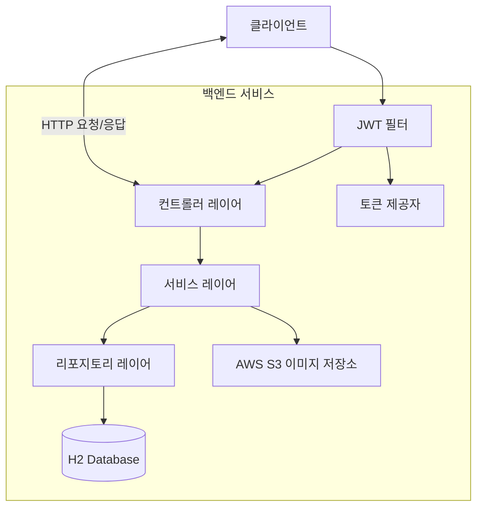
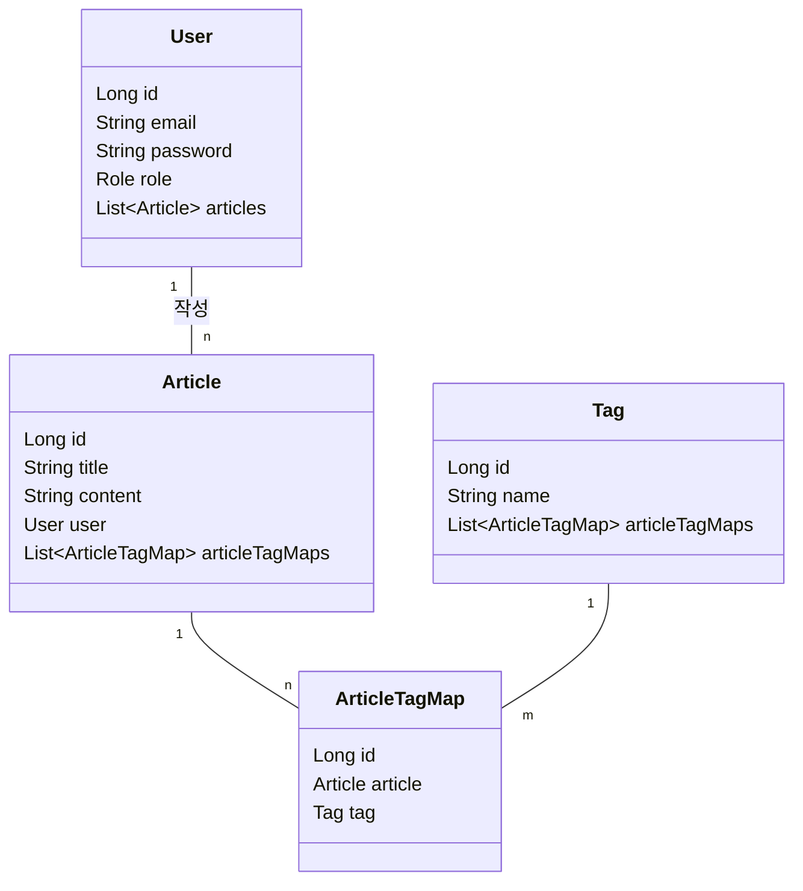

# 🚀 블로그 API

토이 프로젝트로 만든 블로그 백엔드 API입니다. JWT로 인증하고, 게시글/태그 관리와 이미지 업로드 기능이 있어요!

## ✨ 이런 걸 썼어요

- Java 17 + Spring Boot 3.1.4
- Spring Security + JWT 
- JPA + H2 DB
- AWS S3 (이미지 저장용)
- Gradle

## 🔥 주요 기능

- 회원가입/로그인 (JWT 토큰 사용)
- 게시글 작성 (태그 기능 포함)
- 이미지 S3 업로드

## 🛠️ 구현 내용
- 액세스/리프레시 토큰으로 JWT 인증 구현
- JPA 엔티티 설계 (User, Article, Tag)
- 파일 업로드와 S3 연동

## 🏗️ 아키텍처

### 전체 시스템 구조

### 엔티티 관계도

주요 데이터 모델과 그 관계를 보여주는 클래스 다이어그램입니다.

